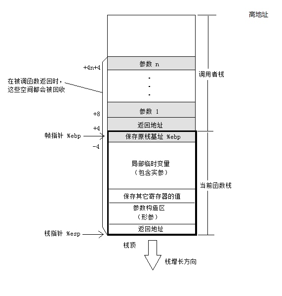
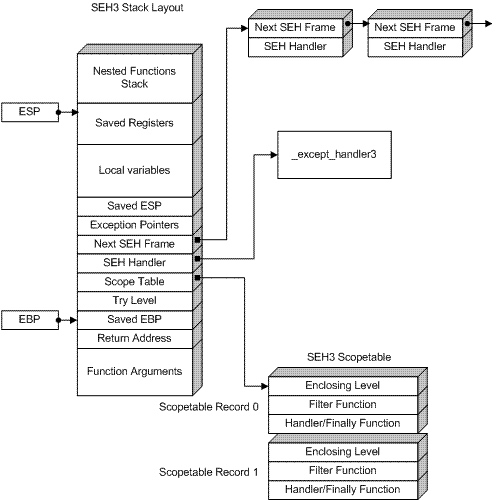
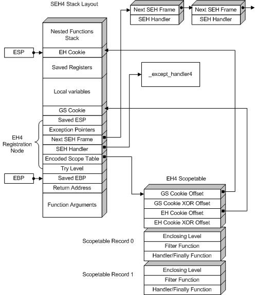
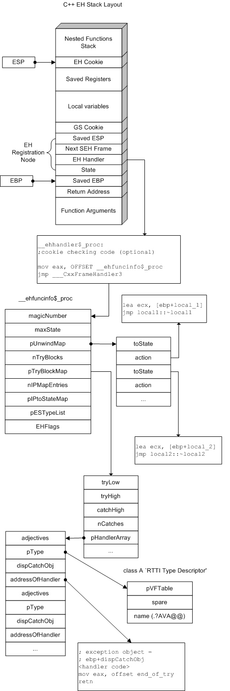
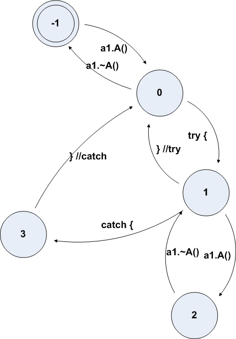
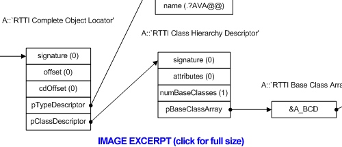
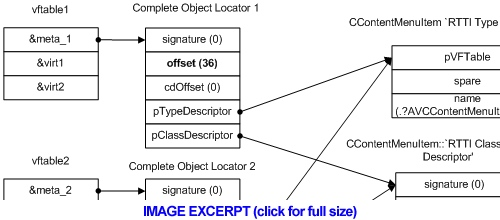
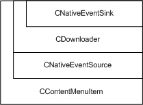

# MSVC++ 逆向

>原文： http://www.openrce.org/articles/full_view/21
>
>翻译：https://jiayu0x.com/2017/04/25/reversing-msvcxx-exception-handling/


# (一) 异常处理


## 摘要

**MSVC++** 是编写 Win32 应用程序最常用的编译器，所以在 Win32 平台的逆向工作中，懂得其底层工作原理，对逆向工程师来说至关重要。掌握 VC++ 程序的底层原理之后，便能在逆向过程中精准、快速识别编译器生成的**胶水代码**（Glue Code），这样可以让逆向工程师快速聚焦于二进制文件背后的真实程序和真实逻辑。另外，这对还原程序中高层次的结构（**`译注`**：面向对象的数据结构和程序组织结构、异常相关数据结构等）也有莫大帮助。

本文只是系列文章的上半部分（下半部分见： [(译)MSVC++ 逆向（二）—— 类、方法和 RTTI](#（二）类、方法和 RTTI)），主要讲栈展开、异常处理以及 MSVC 编译生成相关的数据结构。阅读本文需要有汇编、寄存器和调用约定相关的知识储备，当然，MSVC++ 的编程基础知识也是必要的。


**名词解释**：

> - **栈帧（Stack Frame）**：**栈** 中为**函数**所用的一个 **片段**，里面通常包含函数相关的**参数**（Arguments）、**返回地址**（Return-to-Caller Address）、**保存的寄存器状态**、**本地变量**（Local Variables）和一些其他的数据。在 **x86** 架构（以及其他多数架构）中，栈里调用和被调用的函数，栈帧通常是连续的；
> - **帧指针（Frame Pointer）**：一个指向栈中特定**位置**的指针，指针值通常保存在寄存器或某个变量中。访问函数中的数据，一般通过帧指针和特定**偏移量**来实现。在 **x86** 架构里，**帧指针**通常保存在寄存器 **`ebp`**中，并且，在栈布局结构中位于**返回地址**的下方；
> - **对象（Object）**：C++ 类的实例；
> - **可销毁对象（Unwindable Object）**：又叫**局部对象**，一个具有 `auto` 作用域的本地对象，当帧指针访问其作用域之外的位置时该对象会被销毁（**`译注`**：函数内部本地变量的默认作用域就是 `auto`，函数被调用的时候其内部变量及其他数据被生成到栈上，调用完毕就会销毁这段栈的片段，其内部变量也就随之被销毁）；
> - **栈展开（Stack Unwinding）**：触发异常的时候，将暂停当前函数的执行，根据 `C++` 的 `try/throw/catch` 异常处理流程或 `SEH` 异常处理机制，会在栈段中线性搜索对应的异常处理函数，如果当前栈帧中没有相应的异常处理模块，就会退出当前函数，释放当前函数的内存并销毁局部对象，继续到上层调用函数中寻找对应的异常处理模块，直到找到可以处理该异常的模块……这个过程就是**栈展开**。

在 C/C++ 程序中，可用的异常处理机制有两种：

> - **SEH 异常**：即**结构化异常处理**(Structured Exception Handling)，也称作 **Win32 异常** 或 **系统异常**，这部分内容在 **Matt Pietrek** 的 Paper[1] 里有详尽的讲解。该机制是 C 程序仅有的异常处理机制，在编译器层面支持的关键字有 `__try`/`__except`/`finally` 等等；
> - **C++ 异常**：实现于 SEH 链的顶层，并且支持任意类型的 `throw` 和 `catch`。该异常处理机制一个非常重要的特性是在异常处理过程中的自动栈展开，MSVC++ 为了支持这一特性，在底层做了非常复杂的处理。
>
> **`译注`**：
> 根据 [VC++ 中的异常处理 | MSDN](https://msdn.microsoft.com/zh-cn/library/x057540h.aspx) 所述，自 `MFC3.0` 起，MFC 程序中可以使用 MFC 特有的异常处理机制——**MFC 异常**。

内存中，栈是由高地址向低地址方向增长的，所以在 IDA 中看到的栈，是**向上增长**的。

## 栈的内存布局

基础的栈布局如下所示：

```
---------------
局部变量
---------------
其它寄存器的值
---------------
原栈基址 %ebp
---------------
返回地址
---------------
函数参数
---------------
……
```

具体点，如下图所示：
[](https://jiayu0x.com/imgs/14931296110235.jpg)

> **NOTE**:
> 如果设置了 **`FPO`**（Frame Pointer Omission， 框架指针省略），`原栈基址 %ebp` 可能就不存在了。

## SEH

当涉及到编译器层面的 **SEH**（`__try/__except/__finally`） 时，栈的内存布局就会变的复杂一些：
[](https://jiayu0x.com/imgs/14931296634632.jpg)

一个函数中如果没有 `__try` 语句块（只有 `__finally`），`Saved ESP` 就不会存在。另外，**作用域描述表**（ `scopetable` ）是一个记录每一个 `try` 块及其关系描述的数组：

```
struct _SCOPETABLE_ENTRY {
    DWORD EnclosingLevel;
    void* FilterFunc;
    void* HandlerFunc;
}
```

更多 SEH 具体的实现细节可以查阅参考资料[1]。为了恢复 `try` 语句块，需要监控 `try` 层面的变量变化。 SEH 为每一个 `try` 语句块分配了一个编号，语句块之间的相互联系用上面的 `scopetable` 结构体来描述。举个栗子，假设编号为 `i` 的 `scopetable` ，其中属性 `EnclosingLevel` 值为 `j`，那么编号为 `j` 的 `try` 语句块会把 `i` 闭合在自己的作用域内。然后该函数的 `try level` 可以认为是 `-1` 。具体例子可以参考**附录1**。

## 栈越界（溢出）保护

`Whidbey` 编译器（即 **MSVC-2005**）为栈中的 SEH 帧添加了缓冲区溢出保护机制，如此一来，栈内存布局就变成了下图这样：
[](https://jiayu0x.com/imgs/14931297820310.jpg)

`EH Cookie` 会一直存在，而 `GS cookie` 段只有在编译时开启了 `/GS` 选项才会出现。`SEH4` 的作用域描述表（ `scopetable` ）跟 `SEH3` 的差不多，不同的是多了以下两组头部字段：

```
struct _EH4_SCOPETABLE {
    DWORD GSCookieOffset;
    DWORD GSCookieXOROffset;
    DWORD EHCookieOffset;
    DWORD EHCookieXOROffset;
    _EH4_SCOPETABLE_RECORD ScopeRecord[1];
};

struct _EH4_SCOPETABLE_RECORD {
    DWORD EnclosingLevel;
    long (*FilterFunc)();
    union {
        void (*HandlerAddress)();
        void (*FinallyFunc)();
    };
};
```

`GSCookieOffset = -2` 表示没有启用 `GS cookie` ，`EH cookie` 会一直启用，并且访问时用到的偏移都是相对于 `%ebp` 来计算的。对 `security_cookie` 的校验方式为：

```
(ebp+CookieXOROffset) ^ [ebp+CookieOffset] == _security_cookie
```

栈中指向 `scopetable` 的指针也要与 `_security_cookie` 进行异或计算。另外，`SEH4` 中最外层的作用域层级（`scope level`）是 `-2` ，而不是像 `SEH3` 中那样的 `-1`。

## C++ 异常模型实现

如果函数中实现了 C++ 的异常处理，或者可销毁的**局部对象**，栈的内存布局就会变得更加复杂起来：
[](https://jiayu0x.com/imgs/14931309060247.jpg)

不同于 SEH，C++ 每一个函数中的异常处理内存布局都不相同，通常是如下形式：

```
// (VC7+)
mov eax, OFFSET __ehfuncinfo
jmp ___CxxFrameHandler
```

其中，`__ehfuncinfo` 是一个 `FuncInfo` 结构对象，该结构中囊括了函数中所有的 `try/catch` 块的描述以及可销毁对象信息：

```
struct FuncInfo {
    // 编译器版本
    // 0x19930520: 低于 VC6； 0x19930521: VC7.x(2002-2003)；0x19930522: VC8 (2005)
    DWORD magicNumber;

    // 栈展开描述表中的入口数量
    // number of entries in unwind table
    int maxState;

    // 栈展开处理方法绑定表
    // table of unwind destructors
    UnwindMapEntry* pUnwindMap;

    // 函数中的 try 语句块数量
    DWORD nTryBlocks;

    // try-catch 映射表
    // mapping of catch blocks to try blocks
    TryBlockMapEntry* pTryBlockMap;

    // x86 架构上不可用
    // not used on x86
    DWORD nIPMapEntries;

    // not used on x86
    void* pIPtoStateMap;

    // VC7 及以上版本可用，期望异常列表
    // VC7+ only, expected exceptions list (function "throw" specifier)
    ESTypeList* pESTypeList;

    // VC8 及以上版本可用，但以 /EHs 选项编译时会置 零
    // VC8+ only, bit 0 set if function was compiled with /EHs
    int EHFlags;
};
```

栈展开映射（`Unwind map`）类似 SEH 作用域描述表（`SEH scopetable`），只是少了过滤函数：

```
struct UnwindMapEntry {
    int toState;        // target state
    void (*action)();   // 栈展开时调用的处理函数
};
```

`try` 语句块描述结构体，描述一个 `try{}` 块对应的 `catch{}` 块的映射信息：

```
struct TryBlockMapEntry {
    int tryLow;
    int tryHigh;    // this try {} covers states ranging from tryLow to tryHigh
    int catchHigh;  // highest state inside catch handlers of this try
    int nCatches;   // number of catch handlers
    HandlerType* pHandlerArray; //catch handlers table
};
```

`catch` 语句块描述表，描述对应某个 `catch{}` 块的单个 `try{}` 块的相关信息：

```
struct HandlerType {
    // 0x01: const, 0x02: volatile, 0x08: reference
    DWORD adjectives;

    // RTTI descriptor of the exception type. 0=any (ellipsis)
    TypeDescriptor* pType;

    // ebp-based offset of the exception object in the function stack.
    // 0 = no object (catch by type)
    int dispCatchObj;

    // address of the catch handler code.
    // returns address where to continues execution (i.e. code after the try block)
    void* addressOfHandler;
};
```

期望异常列表（MSVC 中默认关闭，需要用 `/d1ESrt` 编译选项开启）：

```
struct ESTypeList {
    // number of entries in the list
    int nCount;

    // list of exceptions; it seems only pType field in HandlerType is used
    HandlerType* pTypeArray;
};
```

`RTTI`（**Run-Time Type Information**，运行时类型识别）类型描述表，描述 C++ 中的类型信息，这里会用 `catch` 块中的类型去匹配 `throw` 出来的异常的类型：

```
struct TypeDescriptor {
    // vtable of type_info class
    const void * pVFTable;

    // used to keep the demangled name returned by type_info::name()
    void* spare;

    // mangled type name, e.g. ".H" = "int", ".?AUA@@" = "struct A", ".?AVA@@" = "class A"
    char name[0];
};
```

前面说过，不同于 SEH，C++ 每一个函数中的异常处理内存布局都不相同。编译器不仅会在 进/出 `try` 语句块的时候改变状态值，在创建/销毁一个对象的时候状态值也会做出相应改变。这样一来，异常被触发的时候就可以知道哪一个对象应该被栈展开而销毁。并且，我们还可以通过检查相关状态变化和 `try` 语句块处理句柄的返回地址来最终恢复 `try` 语句块的边界（详见 **附录2**）。

## 抛出 C++ 异常

C++ 中的 `throw` 表达式在底层会转换为对 `_CxxThrowException()` 的调用，这个调用会以特征码 `0xE06D7363`（`'msc'|0xE0000000`) 抛出一个 Win32 异常（即 SEH 异常）。SEH 异常的自定义参数里有异常对象及其对应的 `ThrowInfo` 结构体对象，其中 `ThrowInfo` 结构描述了被抛出来的异常的类型，异常处理句柄可以拿此类型与 `catch` 块中的期望异常类型做匹配检索。下面是 `ThrowInfo` 的结构定义：

```
struct ThrowInfo {
    // 0x01: const, 0x02: volatile
    DWORD attributes;

    // exception destructor
    void (*pmfnUnwind)();

    // forward compatibility handler
    int (*pForwardCompat)();

    // list of types that can catch this exception.
    // i.e. the actual type and all its ancestors.
    CatchableTypeArray* pCatchableTypeArray;
};

struct CatchableTypeArray {
    // number of entries in the following array
    int nCatchableTypes;
    CatchableType* arrayOfCatchableTypes[0];
};
```

其中，`CatchableType` 定义了可以 `catch` 这种异常的类型：

```
struct CatchableType {
    // 0x01: simple type (can be copied by memmove), 0x02: can be caught by reference only, 0x04: has virtual bases
    DWORD properties;

    // see above
    TypeDescriptor* pType;

    // how to cast the thrown object to this type
    PMD thisDisplacement;

    // object size
    int sizeOrOffset;

    // copy constructor address
    void (*copyFunction)();
};

// Pointer-to-member descriptor.
struct PMD {
    // member offset
    int mdisp;

    // offset of the vbtable (-1 if not a virtual base)
    int pdisp;

    // offset to the displacement value inside the vbtable
    int vdisp;
};
```

我们会在下一篇深入阐述这一方面的内容。

## **序言** 与 **结语**（Prologs & Epilogs）

为了避免向函数体部分注入设置栈帧的代码，编译器通常会选择用一些**序言**（**Prologs**）和**结语**（**epilog**）函数做一些处理。不过形式多种多样，不同类型的序言或结语作用于不同的函数类型：

| Name                                      | Type   | EH Cookie | GS Cookie | Catch Handlers |
| :---------------------------------------- | :----- | :-------- | :-------- | :------------- |
| _SEH_prolog/_SEH_epilog                   | SEH3   | -         | -         |                |
| _SEH_prolog4/_SEH_epilog4 S               | EH4    | +         | -         |                |
| _SEH_prolog4_GS/_SEH_epilog4_GS           | SEH4   | +         | +         |                |
| _EH_prolog                                | C++ EH | -         | -         | +/-            |
| _EH_prolog3/_EH_epilog3                   | C++ EH | +         | -         | -              |
| _EH_prolog3_catch/_EH_epilog3             | C++ EH | +         | -         | +              |
| _EH_prolog3_GS/_EH_epilog3_GS             | C++ EH | +         | +         | -              |
| _EH_prolog3_catch_GS/_EH_epilog3_catch_GS | C++ EH | +         | +         | +              |

## SEH2

当然，这个在早期的 `MSVC1.xx` 中才会用到（从 `crtdll.dll` 中导出），在一些运行在旧版 NT 上的程序中会碰到。其内存布局如下所示：

```
Saved edi
Saved esi
Saved ebx
Next SEH frame
Current SEH handler (__except_handler2)
Pointer to the scopetable
Try level
Saved ebp (of this function)
Exception pointers
Local variables
Saved ESP
Local variables
Callee EBP
Return address
Function arguments
```

## 附录 1：SEH 程序示例

参考以下反汇编出来的结果：

```
func1           proc near

_excCode        = dword ptr -28h
buf             = byte ptr -24h
_saved_esp      = dword ptr -18h
_exception_info = dword ptr -14h
_next           = dword ptr -10h
_handler        = dword ptr -0Ch
_scopetable     = dword ptr -8
_trylevel       = dword ptr -4
str             = dword ptr  8

    push    ebp
    mov     ebp, esp
    push    -1
    push    offset _func1_scopetable
    push    offset _except_handler3
    mov     eax, large fs:0
    push    eax
    mov     large fs:0, esp
    add     esp, -18h
    push    ebx
    push    esi
    push    edi

; --- end of prolog ---

    mov     [ebp+_trylevel], 0 ;trylevel -1 -> 0: beginning of try block 0
    mov     [ebp+_trylevel], 1 ;trylevel 0 -> 1: beginning of try block 1
    mov     large dword ptr ds:123, 456
    mov     [ebp+_trylevel], 0 ;trylevel 1 -> 0: end of try block 1
    jmp     short _endoftry1

_func1_filter1:   ; __except() filter of try block 1
    mov     ecx, [ebp+_exception_info]
    mov     edx, [ecx+EXCEPTION_POINTERS.ExceptionRecord]
    mov     eax, [edx+EXCEPTION_RECORD.ExceptionCode]
    mov     [ebp+_excCode], eax
    mov     ecx, [ebp+_excCode]
    xor     eax, eax
    cmp     ecx, EXCEPTION_ACCESS_VIOLATION
    setz    al
    retn

_func1_handler1:   ; beginning of handler for try block 1
    mov     esp, [ebp+_saved_esp]
    push    offset aAccessViolatio ; "Access violation"
    call    _printf
    add     esp, 4
    mov     [ebp+_trylevel], 0 ;trylevel 1 -> 0: end of try block 1

_endoftry1:
    mov     edx, [ebp+str]
    push    edx
    lea     eax, [ebp+buf]
    push    eax
    call    _strcpy
    add     esp, 8
    mov     [ebp+_trylevel], -1 ; trylevel 0 -> -1: end of try block 0
    call    _func1_handler0     ; execute __finally of try block 0
    jmp     short _endoftry0

_func1_handler0:   ; __finally handler of try block 0
    push    offset aInFinally ; "in finally"
    call    _puts
    add     esp, 4
    retn

_endoftry0:
  ; --- epilog ---
    mov     ecx, [ebp+_next]
    mov     large fs:0, ecx
    pop     edi
    pop     esi
    pop     ebx
    mov     esp, ebp
    pop     ebp
    retn
func1 endp

_func1_scopetable
    ;try block 0
    dd -1                      ;EnclosingLevel
    dd 0                       ;FilterFunc
    dd offset _func1_handler0  ;HandlerFunc

    ;try block 1
    dd 0                       ;EnclosingLevel
    dd offset _func1_filter1   ;FilterFunc
    dd offset _func1_handler1  ;HandlerFunc
```

注意，上面的 `0` 号 `try` 块并没有过滤器，所以它的处理句柄是 `__finally{}` 语句块。`try` 块 `1` 的 `EnclosingLevel` 是 `0`，所以它被 `0` 号 `try` 块所闭合。由此以来，我们可以大概构造出上面程序的大概结构：

```
void func1 (char* str)
{
  char buf[12];
  __try // try block 0
  {
     __try // try block 1
     {
       *(int*)123=456;
     }
     __except(GetExceptCode() == EXCEPTION_ACCESS_VIOLATION)
     {
        printf("Access violation");
     }
     strcpy(buf,str);
  }
  __finally
  {
     puts("in finally");
  }
}
```

## 附录 2：带 SEH 异常的 C++ 程序示例

```
func1           proc near

_a1             = dword ptr -24h
_exc            = dword ptr -20h
e               = dword ptr -1Ch
a2              = dword ptr -18h
a1              = dword ptr -14h
_saved_esp      = dword ptr -10h
_next           = dword ptr -0Ch
_handler        = dword ptr -8
_state          = dword ptr -4

    push    ebp
    mov     ebp, esp
    push    0FFFFFFFFh
    push    offset func1_ehhandler
    mov     eax, large fs:0
    push    eax
    mov     large fs:0, esp
    push    ecx
    sub     esp, 14h
    push    ebx
    push    esi
    push    edi
    mov     [ebp+_saved_esp], esp

    ; --- end of prolog ---

    lea     ecx, [ebp+a1]
    call    A::A(void)
    mov     [ebp+_state], 0          ; state -1 -> 0: a1 constructed
    mov     [ebp+a1], 1              ; a1.m1 = 1
    mov     byte ptr [ebp+_state], 1 ; state 0 -> 1: try {
    lea     ecx, [ebp+a2]
    call    A::A(void)
    mov     [ebp+_a1], eax
    mov     byte ptr [ebp+_state], 2 ; state 2: a2 constructed
    mov     [ebp+a2], 2              ; a2.m1 = 2
    mov     eax, [ebp+a1]
    cmp     eax, [ebp+a2]            ; a1.m1 == a2.m1?
    jnz     short loc_40109F
    mov     [ebp+_exc], offset aAbc  ; _exc = "abc"
    push    offset __TI1?PAD         ; char *
    lea     ecx, [ebp+_exc]
    push    ecx
    call    _CxxThrowException       ; throw "abc";

loc_40109F:
    mov     byte ptr [ebp+_state], 1 ; state 2 -> 1: destruct a2
    lea     ecx, [ebp+a2]
    call    A::~A(void)
    jmp     short func1_try0end

; catch (char * e)
func1_try0handler_pchar:
    mov     edx, [ebp+e]
    push    edx
    push    offset aCaughtS ; "Caught %s\n"
    call    ds:printf       ;
    add     esp, 8
    mov     eax, offset func1_try0end
    retn

; catch (...)
func1_try0handler_ellipsis:
    push    offset aCaught___ ; "Caught ...\n"
    call    ds:printf
    add     esp, 4
    mov     eax, offset func1_try0end
    retn

func1_try0end:
    mov     [ebp+_state], 0          ; state 1 -> 0: }//try
    push    offset aAfterTry ; "after try\n"
    call    ds:printf
    add     esp, 4
    mov     [ebp+_state], -1         ; state 0 -> -1: destruct a1
    lea     ecx, [ebp+a1]
    call    A::~A(void)
    ; --- epilog ---
    mov     ecx, [ebp+_next]
    mov     large fs:0, ecx
    pop     edi
    pop     esi
    pop     ebx
    mov     esp, ebp
    pop     ebp
    retn
func1           endp

func1_ehhandler proc near
    mov     eax, offset func1_funcinfo
    jmp     __CxxFrameHandler
func1_ehhandler endp

func1_funcinfo
    dd 19930520h            ; magicNumber
    dd 4                    ; maxState
    dd offset func1_unwindmap ; pUnwindMap
    dd 1                    ; nTryBlocks
    dd offset func1_trymap  ; pTryBlockMap
    dd 0                    ; nIPMapEntries
    dd 0                    ; pIPtoStateMap
    dd 0                    ; pESTypeList

func1_unwindmap
    dd -1
    dd offset func1_unwind_1tobase ; action
    dd 0                    ; toState
    dd 0                    ; action
    dd 1                    ; toState
    dd offset func1_unwind_2to1 ; action
    dd 0                    ; toState
    dd 0                    ; action

func1_trymap
    dd 1                    ; tryLow
    dd 2                    ; tryHigh
    dd 3                    ; catchHigh
    dd 2                    ; nCatches
    dd offset func1_tryhandlers_0 ; pHandlerArray
    dd 0

func1_tryhandlers_0
    dd 0                    ; adjectives
    dd offset char * 'RTTI Type Descriptor' ; pType
    dd -1Ch                 ; dispCatchObj
    dd offset func1_try0handler_pchar ; addressOfHandler
    dd 0                    ; adjectives
    dd 0                    ; pType
    dd 0                    ; dispCatchObj
    dd offset func1_try0handler_ellipsis ; addressOfHandler

func1_unwind_1tobase proc near
    a1 = byte ptr -14h
    lea     ecx, [ebp+a1]
    call    A::~A(void)
    retn
func1_unwind_1tobase endp

func1_unwind_2to1 proc near
    a2 = byte ptr -18h
    lea     ecx, [ebp+a2]
    call    A::~A(void)
    retn
func1_unwind_2to1 endp
```

我们来看上述程序示例，`FuncInfo` 结构体中的 `maxState` 域值为 `4`，这表明**栈展开映射表**中有 `4` 个入口点，编号 **0-3** 。检查映射表，可以看到在栈展开过程中会执行的相应动作有以下 `4` 个：

> - state 3 -> state 0 (NOP)
> - state 2 -> state 1 (析构 `a2` )
> - state 1 -> state 0 (NOP)
> - state 0 -> state -1 (析构 `a1` )

再看 `try` 语句映射表，我们可以推断， `state 1` 和 `state2` 对应 `try` 语句块的执行逻辑，而 `sttate3` 对应 `catch` 语句块的执行逻辑。这样一来，`state 0 -> 1` 的变化代表了 `try` 语句块的**开始**，`state 1 - >0` 代表 `try` 语句块的**结束**。另外，我们还可以推断 `state -1 --> 0` 代表创建 `a1`；`state 1 -> 2` 代表创建 `a2`。具体的状态装换和相应的程序执行逻辑如下图所示：
[](https://jiayu0x.com/imgs/14932976893461.gif)
看到这里可能会心生疑惑：`1 -> 3` 那个箭头是从哪儿来的？其实这是在异常处理句柄内部发生的，我们从**函数代码**和 `FuncInfo` 结构体中都看不出来罢了。如果一个异常在 `try` 块内部被触发，异常处理句柄在调用相应的 `catch` 块之前，首先要做的就是把栈展开到 `tryLow` 那一层（上面例子中的 `state 1`），然后把状态值 `state` 设置为 `tryHigh+1`（即 `2+1=3`）。

`try` 语句块对应 2 个 `catch` 句柄。第一个有一个 `catch` 的类型（ `char*` ），并且在栈 `-1Ch` 处获取到异常对象。第二个没有对应的异常类型，什么也不做，相当于忽略异常。两个句柄都会返回函数继续执行的地址，这个地址其实就紧随 `try` 块之后。这样我们试着还原一下该函数：

```
void func1 ()
{
    A a1;
    a1.m1 = 1;
    try {
        A a2;
        a2.m1 = 2;
        if (a1.m1 == a1.m2) throw "abc";
    }
    catch(char* e)
    {
        printf("Caught %s\n",e);
    }
    catch(...)
    {
        printf("Caught ...\n");
    }
    printf("after try\n");
}
```

## 附录 3: IDC 辅助脚本

我编写了一个 IDC 脚本用来辅助对 MSVC 程序的逆向分析。它会在整个程序中搜索 SEH/EH 的代码段，并且为所有相关的结构体和结构体元素添加注释。可以被注释的项有**栈变量**、**异常处理句柄**、**异常类型**及其他相关元素。它还能尝试修复 IDA 中误判的函数边界。该脚本的下载链接： [MS SEH/EH 逆向辅助脚本](http://www.openrce.org/downloads/details/196) 。

## 参考资料

### 原文参考资料：

1. http://www.microsoft.com/msj/0197/exception/exception.aspx
2. http://blogs.msdn.com/branbray/archive/2003/11/11/51012.aspx
3. http://blogs.msdn.com/cbrumme/archive/2003/10/01/51524.aspx
4. http://www.codeproject.com/cpp/exceptionhandler.asp
5. http://www.cs.arizona.edu/computer.help/policy/DIGITAL_unix/AA-PY8AC-TET1_html/callCH5.html

### 翻译参考资料

1. http://www.cnblogs.com/samo/articles/3092895.html
2. http://www.cnblogs.com/Winston/archive/2009/04/19/1439184.html
3. https://msdn.microsoft.com/en-us/library/8dbf701c(v=vs.80).aspx
4. http://www.nynaeve.net/?p=91
5. http://www.cnblogs.com/awpatp/archive/2009/11/04/1595988.html
6. https://en.wikibooks.org/wiki/C%2B%2B_Programming/RTTI


# （二）类、方法和 RTTI

这是本系列第二篇（第一篇 👉： [MSVC++ 逆向(1)——异常处理](#(一) 异常处理) ），本篇将介绍 MSVC 中实现的 C++ 底层机制，包括逆向过程中的 **类结构内存布局**、**虚函数**、**RTTI**（**Run-Time Type Information**，运行时类型识别）。阅读本文需要有 C++ 基础知识以及汇编和逆向相关基础。


## 类的内存布局基础

为了方便阐述接下来的内容，先看一段简单的 C++ 代码示例：

```
class A
{
	int a1;
public:
      virtual int A_virt1();
      virtual int A_virt2();
      static void A_static1();
      void A_simple1();
};

class B
{
	int b1;
    int b2;
public:
    virtual int B_virt1();
    virtual int B_virt2();
};

class C: public A, public B
{
    int c1;
public:
    virtual int A_virt2();
    virtual int B_virt2();
};
```

多数情况下 MSVC++ 的 **类** 中个元素在内存布局中的顺序如下：

- 指向**虚函数表**的**指针**（ `_vtable_` 或者 `_vftable_` ），仅当类中有**虚函数**、并且**基类**中没有相应的**虚函数表**的时候才有此指针元素；
- 基类
- 类成员

**虚函数表**中囊括了类中的各个**虚函数**，以虚函数声明的顺序排列。其中，**重载函数** 的 **地址** 覆盖基类中相应函数的地址。如此一来，上面 3 个类在内存中的布局大概如下所示：

```
class A size(8)
       +---
    0  | {vfptr}
    4  | a1
       +---

A's vftable:
    0  | &A::A_virt1
    4  | &A::A_virt2
-----------------------

class B size(12):
        +---
    0   | {vfptr}
    4   | b1
    8   | b2
        +---

B's vftable:
    0   | &B::B_virt1
    4   | &B::B_virt2
-----------------------

class C size(24):
         +---
         | +--- (base class A)
    0    | | {vfptr}
    4    | | a1
         | +---
         | +--- (base class B)
    8    | | {vfptr}
    12   | | b1
    16   | | b2
         | +---
    20   | c1
         +---

C's vftable for A:
    0   | &A::A_virt1
    4   | &C::A_virt2

C's vftable for B:
    0   | &B::B_virt1
    4   | &C::B_virt2
```

上面的图表是在 VC8 中用一个文档中没说明的编译选项生成的，对于编译器产生的类内存布局图表，用 `-d1reportSingleClassLayout` 编译选项可以查看单个类的布局图表；用 `-d1reportAllClassLayout` 可以查看所有类的内存布局（包括内部的 CRT 类），布局图表会在 `stdout` 中输出。

从上面编译器生成的图表可以看出，类 `C` 里有两个 **虚函数表**，这是因为它继承了两个基类，而两个基类均有自己的虚函数成员。在类 C 的第一个虚函数表中，虚函数 `C::A_virt2()` 的地址覆盖了基类 A 在 C 中派生的 `A_virt2()` 的地址；类似地，在类 C 的第二个虚函数表中，虚函数 `C::B_virt2()` 的地址覆盖了基类 B 在 C 中派生的 `B_virt2()` 的地址。

## 调用约定与类方法

MSVC++ 中的类方法调用时，默认遵守 `_thiscall_` 调用约定。通过类的对象调用**非静态成员函数**或**非全局函数时**，类的对象自身的地址（即 `*this` 指针的值）会以**隐含参数**的形式传递给被调用的类的成员函数，通常，这个 `*this` 指针的值，存储在寄存器 `ecx` 中。在函数体的实现中，编译器通常把这个指针值塞在其他寄存器中（比如 `esi` 或 `edi` ），或者直接存入栈中的某个变量，然后对其他所有类成员的访问，都基于这个地址进行相对寻址来实现。然而，当实现 `COM` 类的时候，对类成员函数的调用则遵循 `_stdcall_` 的调用约定。下面详述几种不同的类成员方法调用时的底层细节：

### 1) 静态成员函数

调用**静态成员函数**不需要类的实例对象，可以直接通过类名来调用，在底层看来就跟调用普通非成员函数差不多，并不涉及 `*this` 指针的隐式传递。不过，也正因如此，逆向过程中不容易区分类的静态成员函数和普通的非成员函数。比如：

```
A::A_static1();
call    A::A_static1
```

### 2) 普通成员函数

**普通成员函数**的调用，就需要通过类的实例对象来调用了，这种情况下 `*this` 指针会以隐含参数的形式作为被调函数的第一个参数传递进去，并遵循 `_thiscall_` 调用约定，在底层会存储在 `ecx` 寄存器中。另外，如果存在类继承的情况，基类对象的地址可能与派生类的对象的地址不同，这时候如果在派生类的对象中调用基类的成员函数， `*this` 指针的值需要调整到**基类对象**的起始地址，然后才能调用基类中的普通成员函数。示例如下：

```
;pC->A_simple1(1);
;esi = pC
push    1
mov ecx, esi
call    A::A_simple1

;pC->B_simple1(2,3);
;esi = pC
lea edi, [esi+8] ;调整 *this 指针的值
push    3
push    2
mov ecx, edi
call    B::B_simple1
```

如上所示，在调用 `B` 类的成员函数之前， `*this` 指针的值调整为 `B` 类子对象的起始地址。

### 3) 虚函数

为了调用**虚函数**，编译器首先需要从**虚函数表**中取出相应虚函数的起始地址，然后就按照类似普通成员函数调用的方式去调用它（把 `*this` 指针以隐含参数的方式传递），示例如下：

```
;pC->A_virt2()
;esi = pC
mov eax, [esi]  ;获取虚函数表的地址
mov ecx, esi
call [eax+4]  ;调用虚函数表中的第二个虚函数

;pC->B_virt1()
;edi = pC
lea edi, [esi+8] ;调整 *this 指针的值
mov eax, [edi]   ;获取虚函数表的地址
mov ecx, edi
call [eax]       ;调用第一个虚函数
```

### 4) 构造函数和析构函数

**构造函数**和**析构函数**的调用过程，与普通成员函数类似。不同的是，即使按惯例来说构造函数并没有返回值，它仍然会把构造好的类的实例对象的起始地址隐式地返回（`return` 到寄存器 `eax` 中）。

## RTTI 的实现

**RTTI**（Run-Time Type Identification，**运行时类型识别**）是编译器为了支持 C++ 中 `dynamic_cast<>` 和 `typeid()` 两个操作符操作符以及 C++ 异常而生成的特殊编译信息。RTTI 的特性只有当类涉及**多态**的时候才会用到，比如类中声明了**虚函数**。

在类的内存布局中，MSVC 编译器会把一个指向 **`COL`**（Complete Object Locator，**完整对象定位符**）结构体的指针放在**虚函数表**之前。之所以叫**完整对象定位符**，是因为它允许编译器根据一个特定的**虚函数表指针**（一个类中可能有多个**虚函数表指针**）定位到整个对象。**COL**的结构定义如下：

```
struct RTTICompleteObjectLocator
{
    DWORD signature;  // 一直为 0 ?
    DWORD offset;       // 改虚函数表在类中相对与类的起始地址的偏移量（offset of this vtable in the complete class）
    DWORD cdOffset;   // 构造函数偏移（constructor displacement offset）
    struct TypeDescriptor* pTypeDescriptor;  // 整个类的类型描述符（TypeDescriptor of the complete class）
    struct RTTIClassHierarchyDescriptor* pClassDescriptor;  // 类的继承关系描述结构（describes inheritance hierarchy）
};
```

`RTTIClassHierarchyDescriptor` 描述整个类的继承关系，它对类的所有 `COL` 都是通用的。

```
struct RTTIClassHierarchyDescriptor
{
    DWORD signature;      // 一直为 0 ?
    DWORD attributes;     //bit 0 set = 多重继承, bit 1 set = 虚继承
    DWORD numBaseClasses; // pBaseClassArray 中的基类数量（number of classes in pBaseClassArray）
    struct RTTIBaseClassArray* pBaseClassArray;
};
```

`Base Class Array` 定义了在执行 `_dynamic_cast_` 时**派生类**可以动态映射成的所有**基类**的信息，其中每一个**基类描述符**（Base Class Descriptor）的结构如下：

```
struct RTTIBaseClassDescriptor
{
    struct TypeDescriptor* pTypeDescriptor; // 类的类型描述符（type descriptor of the class）
    DWORD numContainedBases; // Base Class Array 中的基类数量（number of nested classes following in the Base Class Array）
    struct PMD where;        // 内部成员偏移信息（pointer-to-member displacement info）
    DWORD attributes;        // 标志位, 通常置 0
};

struct PMD
{
    int mdisp;  // 内部成员偏移（member displacement）
    int pdisp;  // 虚函数表的偏移（vbtable displacement）
    int vdisp;  // 虚函数表的内部偏移（displacement inside vbtable）
};
```

`PMD` 结构描述一个**基类**在其**派生类**中的位置信息。**简单继承**的时候，**基类**相对于其**派生类**的**偏移量**是固定的，偏移量的值即 `_mdisp_` 的值；如果涉及到**虚继承**，就需要先从**虚函数表**中取出一个额外的偏移量一起计算出基类的偏移，在函数调用的时候则需要重新调整 `*this` 指针的值。整个过程的伪码示例如下：

```
//char* pThis; struct PMD pmd;
pThis += pmd.mdisp;
if (pmd.pdisp != -1)
{
  char *vbtable = pThis + pmd.pdisp;
  pThis += *(int*)(vbtable + pmd.vdisp);
}
```

举例来说，文章开头 3 个类的继承关系中 RTTI 的信息图下图所示：

[](https://jiayu0x.com/imgs/14936061421938.jpg)

## 信息提取

### 1) RTTI

如果存在 **RTTI**，那么 **RTTI** 能为逆向工作提供很多有价值的信息。根据 **RTTI**，我们可能还原**类名**、**类的继承关系**，甚至有时候能还原部分类的**内存布局**信息。在 **附录 1** 中，我写了一个 **RTTI 信息扫描器**，可以做进一步参考。

### 2) 静态初始化 和 全局初始化

**全局**和**静态**的对象会在 `main()` 函数前面初始化。在 MSVC++ 中，编译器会为**全局**和**静态**函数生成相应的**初始化器**，并把他们的地址放在一个**表**（`table`）中，这个**表**会在 `_cinit()` 初始化 **CRT** 的时候生成。在 **PE** 结构中，这个**表**通常在 `.data` 段的起始位置。典型的初始化器结构示例如下：

```
_init_gA1:
    mov     ecx, offset _gA1
    call    A::A()
    push    offset _term_gA1
    call    _atexit
    pop     ecx
    retn
_term_gA1:
    mov     ecx, offset _gA1
    call    A::~A()
    retn
```

这样，从上面这个表里我们可以看出：

- **全局**/**静态**对象的地址；
- 它们的**构造函数**
- 它们的**析构函数**

更多细节可以参考 `_#pragma_directive_init_seg_` [5]。

### 3) 栈展开处理函数（Unwind Funclets）

一个函数中生成任何**动态**的对象时，VC++ 编译器总会生成一个相关的异常处理结构，以便在遇到异常时进行栈展开、销毁该动态对象。VC++ 中异常处理的底层细节可以参考本系列前一篇。典型的 `Unwind Funclets` 结构如下：

```
unwind_1tobase:  ; state 1 -> -1
    lea     ecx, [ebp+a1]
    jmp     A::~A()
```

通过在函数体中寻找相反的状态变化，或者在第一次访问栈中的同一个变量，我们也可以找到其**构造函数**：

```
lea     ecx, [ebp+a1]
call    A::A()
mov     [ebp+__$EHRec$.state], 1
```

对与那些用 `new()` 方法创建的对象，**栈展开处理函数** 保证即使在析构函数失效的情况下，也能删除掉分配给这些对象的内存：

```
unwind_0tobase: ; state 0 -> -1
    mov     eax, [ebp+pA1]
    push    eax
    call    operator delete(void *)
    pop     ecx
    retn
```

在函数体中：

```
;A* pA1 = new A();
    push
    call    operator new(uint)
    add     esp, 4
    mov     [ebp+pA1], eax
    test    eax, eax
    mov     [ebp+__$EHRec$.state], 0; state 0: memory allocated but object is not yet constructed
    jz      short @@new_failed
    mov     ecx, eax
    call    A::A()
    mov     esi, eax
    jmp     short @@constructed_ok

@@new_failed:
    xor     esi, esi

@@constructed_ok:
    mov     [esp+14h+__$EHRec$.state], -1
;state -1: either object was constructed successfully or memory allocation failed
;in both cases further memory management is done by the programmer
```

另一种形式的 **栈展开处理函数** 存在于**构造函数** 和 **析构函数** 中，它将保证在程序遇到异常时销毁对象成员。这种情况下的 **栈展开处理函数** 使用的是保存在栈变量中的 `_this_` 指针：

```
unwind_2to1:
    mov     ecx, [ebp+_this] ; state 2 -> 1
    add     ecx, 4Ch
    jmp     B1::~B1
```

上面这个例子中，**栈展开处理函数** 销毁了 `B1` 在偏移 `0x4c` 处的成员。总的来说，通过 **栈展开处理函数**，我们可以获取一下信息：

- 栈中保存的通过 `_operator_new_` 创建的 C++ 对象，或指向对象的指针；
- 类的构造函数；
- 类的析构函数；
- `new()` 创建出来的对象的 `size`。

### 4) 递归构造/析构函数

这个规则很简单：**递归构造函数**递归地调用其他构造函数（比如基类的构造函数、其他成员的构造函数）；**递归析构函数** 递归地调用他们所有的析构函数。典型的**构造函数**具有以下功能：

- 调用基类的构造函数；
- 调用其他嵌套对象所属类的构造函数；
- 如果类中声明了**虚函数**，则初始化**虚函数表指针**（ `vfptr` ）；
- 执行程序员定义的**构造函数**函数体。

典型的**析构函数**则具有相对应的以下功能：

- 如果类中声明了**虚函数**，则初始化**虚函数表指针**（ `vfptr` ）；
- 执行程序员定义的**析构函数**函数体；
- 调用其他嵌套对象所属类的析构函数
- 调用基类的析构函数。

不过， MSVC 编译器创建的 **析构函数** 还有一个特性：`_state_` 以**最大值**初始化，并随着对成员对象的析构行为而递减。这样一来反而方便分析析构函数的执行。另外需要注意的是，在 MSVC 中，简单的 构造/析构函数通常是以内联形式存在的，所以经常会在同一个函数中看到**虚函数表指针**被不同指针重复调用。

### 5) 数组构造与析构

MSVC 用辅助函数来完成一个对象数组的构造与析构。用以下代码为例：

```
A* pA = new A[n];
delete [] pA;
```

用 C++ 伪码详细还原一下，大概如下所示：

```
array = new char(sizeof(A)*n+sizeof(int))
if (array)
{
  *(int*)array=n; //store array size in the beginning
  'eh vector constructor iterator'(array+sizeof(int),sizeof(A),count,&A::A,&A::~A);
}
pA = array;

'eh vector destructor iterator'(pA,sizeof(A),count,&A::~A);
```

如果 `A` 包含虚函数，删除对象数组的时候会调用一个 `vector deleting destructor` ：

```
;pA->'vector deleting destructor'(3);
mov ecx, pA
push 3 ; flags: 0x2=deleting an array, 0x1=free the memory
call A::'vector deleting destructor'
```

如果 `A` 的**析构函数**是个**虚函数**，那么析构的时候会以调用虚函数的方式调用析构函数：

```
mov ecx, pA
push 3
mov eax, [ecx] ;fetch vtable pointer
call [eax]     ;call deleting destructor
```

因此，通常来说通过构造/析构的数组迭代调用，我们可以发掘以下信息：

- 对象数组的地址；
- 数组里各对象的构造函数；
- 数组里各对象的析构函数；
- 类的 `size`。

### 6) 删除析构函数（ `deleting destructor` ）

当类中含有**虚析构函数**（ `virtual destructor` ）时，编译器会生成一个辅助函数——**删除析构函数**，这样便能确保销毁一个类实例的时候合适的 `_operator delete_` 被调用。**删除析构函数** 的伪码如下：

```
virtual void * A::'scalar deleting destructor'(uint flags)
{
  this->~A();
  if (flags&1) A::operator delete(this);
};
```

该函数的地址会被放在**虚函数表**( `vftable`) 中，并覆盖原有的析构函数地址。这样一来，如果另外一个类覆盖了这个虚析构函数，那么它的 `_delete_` 将被调用。然而实际代码中 `_delete_` 几乎不会被覆盖，所以你通常只看到调用默认的delete()。有时候，编译器也生成一个删除析构函数向量，伪码示例如下：

```
virtual void * A::'vector deleting destructor'(uint flags)
{
  if (flags&2) //删除一个数组（destructing a vector）
  {
    array = ((int*)this)-1; //数组大小存于此指针前面（array size is stored just before the this pointer）
    count = array[0];
    'eh vector destructor iterator'(this,sizeof(A),count,A::~A);
    if (flags&1) A::operator delete(array);
  }
  else {
    this->~A();
    if (flags&1) A::operator delete(this);
  }
};
```

我忽略了大部分涉及虚基类的类的实现细节，因为它们是在太复杂，而且在现实生活中很少用到。请参考 Jan Gray 的文章[1]，它非常相近（请忽略那看着脑仁疼的匈牙利命名法）。文章[2]描述了一个MSVC实现虚继承的实现。更多细节还可以看 MS 专利[3]。

## 附录 1： `ms_rtti4.idc`

这是我为解析 **RTTI** 和**虚函数表**写的一个 IDA 脚本，读者可以从 [Microsoft VC++ Reversing Helpers](http://www.openrce.org/downloads/details/196) 下载到该脚本以及本系列两篇文章。该脚本的功能特性有以下几个：

- 解析 **RTTI** 结构、用相应的类名重命名**虚函数表**；
- 在相对简单的分析工作中重命名**构造函数**与**析构函数**；
- 把所有的**虚函数表**以及**引用函数**和类的继承关系输出到文件中。

> **Usage**：
> IDA 的初始化分析结束之后，载入 `ms_rtti4.idc` ，它会询问你是否要扫描 PE 文件中的**虚函数表**（vftables)。需要注意的是，这个过程可能需要比较长的时间。如果你选择跳过扫描，后续仍然可以手动解析**虚函数表**。如果你选择让脚本帮你执行扫描，脚本会识别 PE 文件中所有使用 **RTTI** 的**虚函数表**，并且会重命名**虚函数表**、识别和重命名构造/析构函数。也有可能脚本会解析失败，尤其是涉及到**虚继承**的情况。扫描结束后，脚本会自动打开存放扫描结果的文件。

另外，脚本载入以后，可以使用以下 **快捷键** 来对 MSVC 生成的结构进行手动解析：

- **`Alt+F8`**：解析一个**虚函数表。游标应该会停在虚函数表的起始位置。如果里面用到了** RTTI**，脚本会使用里面的类名来重命名虚函数表。如果没有涉及到** RTTI**，你可以手动输入类名来自定义。如果脚本扫描到了**虚析构函数**，一样也会把它重命名。

- **`Alt+F7`**：解析 `FuncInfo` 结构。`FuncInfo` 是一个描述在栈上创建对象或使用异常处理句柄的函数信息的结构。它的地址在异常处理句柄中通常被解析为 `_CxxFrameHandler` ：

  ```
  mov eax, offset FuncInfo1
  jmp _CxxFrameHandler
  ```

  多数情况下它会被 IDA 直接识别并解析，但是我提供的脚本可以解析出更多的信息，你可以用 `ms_ehseh.idc` 解析文件中的所有 `FuncInfo` 。
  游标放到 `FuncInfo` 起始位置的，此快捷键有效。

- **`Alt+F9`**：解析 `throw` 信息。`Throw info` 是 `_CxxThrowException` 在实现 `_throw` 操作符时用到的辅助结构，它通常作为 `_CxxThrowException` 的第二个参数被调用：

  ```
  lea     ecx, [ebp+e]
  call    E::E()
  push    offset ThrowInfo_E
  lea     eax, [ebp+e]
  push    eax
  call    _CxxThrowException
  ```

  游标放在 `throw info` 起始位置的时候次快捷键才有效。该脚本会解析 `throw info` 并为调用 `throw` 操作符的类添加注释。它还可以识别和重命名异常的析构函数和拷贝构造函数。

## 附录 2：实战恢复一个类的结构

我们练手的对象是 `MSN Messenger 7.5` （ `msnmsgr.exe` 版本是 `7.5.324.0` , 大小 7094272 Bytes ），它主要由 C++ 实现，并且里面用到了很多 **RTTI** 的结构，正符合我们的需求。先看一下位于 `.0040EFD8` 和 `.0040EFE0` 的两处**虚函数表**。其中完整的 RTTI 结构及其继承关系如下所示：
[](https://jiayu0x.com/imgs/14938199737802.jpg)

这样一来，就有了两个**虚函数表**属于同一个**类** —— `CContentMenuItem` ，再看它们的**基类描述符**我们可以发现：

- `CContentMenuItem` 里面包含 3 个**基类** —— `CDownloader`/`CNativeEventSink`/`CNativeEventSource`;
- `CDownloader` 包含 1 个**基类** —— `CNativeEventSink`；
- 因此 `CContentMenuItem` 继承自 `CDownloader` 和 `CNativeEventSource`，而 `CDownloader` 继承自 `CNativeEventSink`；
- `CDownloader` 位于整个对象的起始位置，`CNativeEventSource` 则位于偏移为 `0x24` 的位置。

[](https://jiayu0x.com/imgs/14938205753585.jpg)

据此，我们可以得出这么一个结论：第一个**虚函数表**列出了 `CNativeEventSource` 里的方法，第二个**虚函数表**列出了 `CDownloader` 或者 `CNativeEventSink` 里的方法（如果这两者都不是，`CContentMenuItem` 会重用 `CNativeEventSource` 的**虚函数表**）。我们再来看都有谁引用了这两个**虚函数表**，它们**都**被位于 `.052B5E0` 和 `.052B547` 的两个函数引用（这样进一步印证了它们属于同一个**类**）。如果我们仔细查看 `.052B547` 处函数的开头，可以发现 `_state_` 被初始化为 `6`，这表明该函数是一个 **析构函数**；由于一个类只能有 1 个析构函数，我们可以推断 `.052B5E0` 处的函数是一个**构造函数**：

```asm
CContentMenuItem::CContentMenuItem   proc near
this = esi
    push    this
    push    edi
    mov     this, ecx
    call    sub_4CA77A
    lea     edi, [this+24h]
    mov     ecx, edi
    call    sub_4CBFDB
    or      dword ptr [this+48h], 0FFFFFFFFh
    lea     ecx, [this+4Ch]
    mov     dword ptr [this], offset const CContentMenuItem::'vftable'{for 'CContentMenuItem'}
    mov     dword ptr [edi], offset const CContentMenuItem::'vftable'{for 'CNativeEventSource'}
    call    sub_4D8000
    lea     ecx, [this+50h]
    call    sub_4D8000
    lea     ecx, [this+54h]
    call    sub_4D8000
    lea     ecx, [this+58h]
    call    sub_4D8000
    lea     ecx, [this+5Ch]
    call    sub_4D8000
    xor     eax, eax
    mov     [this+64h], eax
    mov     [this+68h], eax
    mov     [this+6Ch], eax
    pop     edi
    mov     dword ptr [this+60h], offset const CEventSinkList::'vftable'
    mov     eax, this
    pop     this
    retn
sub_52B5E0      endp
```

编译器在**预言**(`prolog`) 之后要做的第一件事就是把 `_this_` 指针的值从 `ecx` 拷贝到 `esi`，继而后续所有的寻址都是相对于 `esi` 作为基址。在初始化**虚函数表指针**(`vfptrs`) 之前调用了两个其他函数，这一定是**基类的构造函数**——本例中即 `CDownloader` 和 `CNativeEventSource` 的构造函数。进一步深入函数跟踪分析可以帮助我们确认这一点：第一个**虚函数表指针**（ `vfptf` ）用 `CDownloader::'vftable'` 来初始化， 第二个**虚函数表指针**用 `CNativeEventSource::'vftable'` 来初始化。我们也可以进一步检查 `CDownloader` 的**构造函数** —— 它调用了其**基类** `CNativeEventSink` 的构造函数。

类似的，`_this_` 指针的值通过 `edi` 传入，这时它被重置为 `_this_ + 24h` ，根据我们上面的类结构图来看，这是 `CNativeEventSource` 子对象的位置。这是另一个证明被调用的第二个函数是 `CNativeEventSource` 的构造函数的证据。

结束了基类的构造函数调用过程之后，**基类**中的**虚函数指针**被 `CContentMenuItem` 中自己的实现所覆盖，即 `CContentMenuItem` 实现了基类中的部分**虚函数**（或者增加了自己的**虚函数**）。有必要的话，我们可以对比这些表、检查那些指针被修改过或被添加了——新添加的指针就是 `CContentMenuItem` 中新实现的虚函数。

接下来我们就看到几个对地址 `.04D8000` 的调用，调用之前 `ecx` 的值被设置为 `this+4Ch` 到 `this+5Ch` —— 这很明显是在初始化成员对象。一个问题是，我们如何分辨初始化函数是编译器自动生成的构造函数，还是程序员编写的自定义构造函数呢？这里有两个关键点可以参考：

- 函数使用 `_thiscall_` 的 **调用约定**，而且是第一次访问这些字段；
- 字段的初始化顺序是按照地址增长的方向进行的。

为了确定这些点，我们可以查看**析构函数**中的**栈展开处理函数**（Unwind Funclets），在那里我们可以看到编译器为这些成员变量生成的构造函数。

这个新的类并没有**虚函数**，因此也没有 **RTTI**，所以我们也不知道它的名字，不妨先命名为 RefCountedPtr`。根据前面的分析，位于`.4D8000`的函数是**构造函数**，那么在`CContentMenuItem`我们可以看到析构函数中的**栈展开处理函数**——在`.63CCB4` 处。

回过头去看 `CContentMenuItem` 的 **构造函数**，可以看到 3 个字段初始化为 0，另外一个初始化为一个 **虚函数表指针**（ `vftable pointer` ）。这个看起来想一个成员变量的内联构造函数（不是**基类**，因为**基类**会出现在继承关系树中）。从一个使用了的虚函数表的 RTTI 中我们可以看出这是一个 `CEventSinkList` 模板的实例。

根据上面的分析，我们可以大概勾勒出类的结构声明：

```
class CContentMenuItem: public CDownloader, public CNativeEventSource
{
/* 00 CDownloader */
/* 24 CNativeEventSource */
/* 48 */ DWORD m_unknown48;
/* 4C */ RefCountedPtr m_ptr4C;
/* 50 */ RefCountedPtr m_ptr50;
/* 54 */ RefCountedPtr m_ptr54;
/* 58 */ RefCountedPtr m_ptr58;
/* 5C */ RefCountedPtr m_ptr5C;
/* 60 */ CEventSinkList m_EventSinkList;
/* size = 70? */
};
```

我们不确定偏移为 `0x48` 处的变量是否为 `CNativeEventSource` 的一部分，但由于它并没有被 `CNativeEventSource` 的构造函数访问到，那么它很可能属于 `CContentMenuItem`。包含被重命名函数的构造函数与类的结构如下：

```asm
public: __thiscall CContentMenuItem::CContentMenuItem(void) proc near
    push    this
    push    edi
    mov     this, ecx
    call    CDownloader::CDownloader(void)
    lea     edi, [this+CContentMenuItem._CNativeEventSource]
    mov     ecx, edi
    call    CNativeEventSource::CNativeEventSource(void)
    or      [this+CContentMenuItem.m_unknown48], -1
    lea     ecx, [this+CContentMenuItem.m_ptr4C]
    mov     [this+CContentMenuItem._CDownloader._vfptr], offset const CContentMenuItem::'vftable'{for 'CContentMenuItem'}
    mov     [edi+CNativeEventSource._vfptr], offset const CContentMenuItem::'vftable'{for 'CNativeEventSource'}
    call    RefCountedPtr::RefCountedPtr(void)
    lea     ecx, [this+CContentMenuItem.m_ptr50]
    call    RefCountedPtr::RefCountedPtr(void)
    lea     ecx, [this+CContentMenuItem.m_ptr54]
    call    RefCountedPtr::RefCountedPtr(void)
    lea     ecx, [this+CContentMenuItem.m_ptr58]
    call    RefCountedPtr::RefCountedPtr(void)
    lea     ecx, [this+CContentMenuItem.m_ptr5C]
    call    RefCountedPtr::RefCountedPtr(void)
    xor     eax, eax
    mov     [this+CContentMenuItem.m_EventSinkList.field_4], eax
    mov     [this+CContentMenuItem.m_EventSinkList.field_8], eax
    mov     [this+CContentMenuItem.m_EventSinkList.field_C], eax
    pop     edi
    mov     [this+CContentMenuItem.m_EventSinkList._vfptr], offset const CEventSinkList::'vftable'
    mov     eax, this
    pop     this
    retn
public: __thiscall CContentMenuItem::CContentMenuItem(void) endp
```

## 参考资料：

1. http://msdn.microsoft.com/archive/default.asp?url=/archive/en-us/dnarvc/html/jangrayhood.asp
2. http://www.lrdev.com/lr/c/virtual.html
3. 微软关于 C++ 各部分实现的专利材料：
   - http://freepatentsonline.com/5410705.html
   - http://freepatentsonline.com/5617569.html
   - http://freepatentsonline.com/5754862.html
   - http://freepatentsonline.com/5297284.html
   - http://freepatentsonline.com/5371891.html
   - http://freepatentsonline.com/5603030.html
   - http://freepatentsonline.com/6138269.html
4. http://members.ozemail.com.au/~geoffch@ozemail.com.au/samples/programming/msvc/language/predefined/index.html
5. http://msdn.microsoft.com/library/default.asp?url=/library/en-us/vclang/html/_predir_init_seg.asp