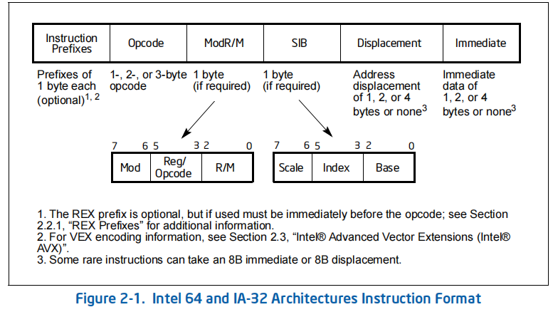

# x86指令集 汇编与反汇编

## INTEL 指令格式

https://c9x.me/x86/

http://ref.x86asm.net/geek.html

[Intel® Intrinsics Guide](https://www.intel.com/content/www/us/en/docs/intrinsics-guide/index.html)

https://github.com/ia32-doc/ia32-doc

## 汇编反汇编引擎

### HDE

https://github.com/Cerbersec/HDE64

### LDE

只能反汇编长度

https://github.com/BeaEngine/lde64

### zasm

https://github.com/zyantific/zasm

https://github.com/zyantific/zydis

### capstone

https://github.com/capstone-engine/capstone

https://github.com/keystone-engine/keystone

### AsmJit

https://github.com/asmjit/asmjit

被x64dbg在内的项目使用

### bddisasm

https://github.com/bitdefender/bddisasm

### xbyak

cpp

https://github.com/herumi/xbyak

### PeachPy

https://github.com/Maratyszcza/PeachPy

### icedland/iced 

Rust, .NET, Java, Python, Lua

https://github.com/icedland/iced